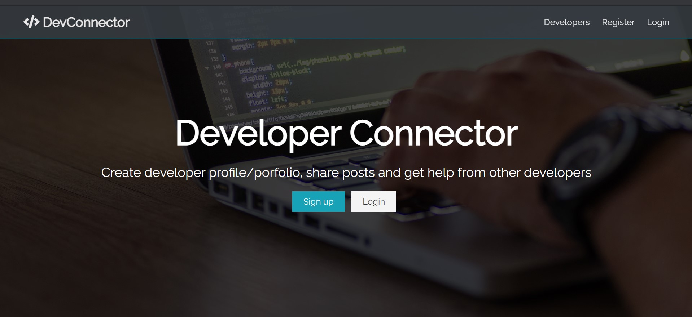

# devconnector

A responsive, mobile-friendly forum for developers to connect, built with HTML and SCSS. 

You can view the hosted site at [devconnector-scss.netlify.app](https://devconnector-scss.netlify.app)

## Concepts learned

- Basics of SCSS
- Adding mobile-friendly and responsive features
- Using functions, mixins, adding configurations
- Creating different CSS classes by using SCSS loops
- Emmet
- Creating custom CSS features
- How to use font awesome, gravatar

Note: You can view the different screenshots in the `ss/` directory.
